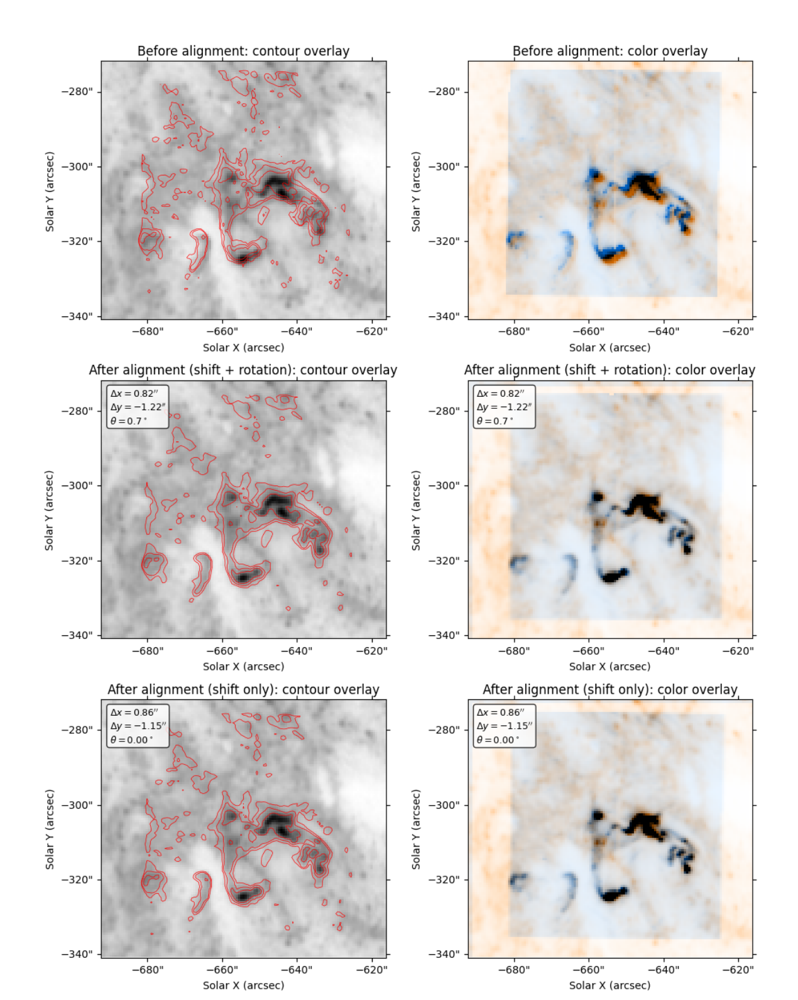
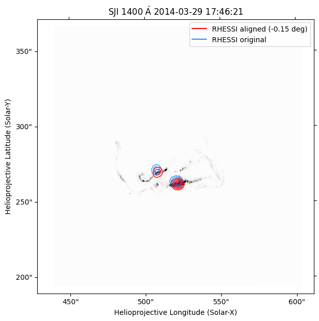
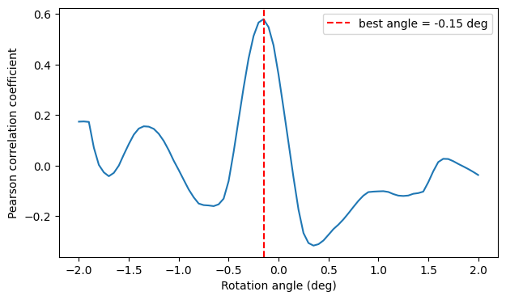
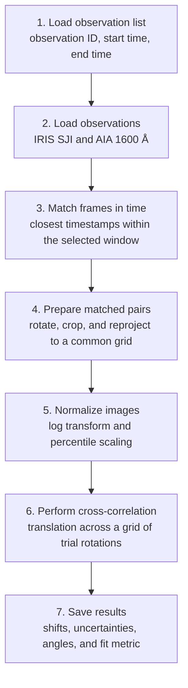

# Automated Co-Alignment of Solar Flare Observations

Python tools developed for the co-alignment part of my MSc thesis at the
University of Bern. The project aligns solar flare observations from the
**Interface Region Imaging Spectrograph (IRIS)**, the **Atmospheric Imaging
Assembly (AIA)** aboard the Solar Dynamics Observatory, and the **Reuven Ramaty
High Energy Solar Spectroscopic Imager (RHESSI)**.

Multi-instrument observations differ in spatial resolution, cadence, and
coordinate system. Accurate co-alignment is therefore required before
structures observed at different wavelengths can be compared. This repository
contains an automated IRIS-AIA batch workflow and an experimental,
rotation-based RHESSI case study.

## Results at a glance

- Aligned **536 IRIS-AIA frame pairs** from **19 solar flares** contained in
  15 IRIS observations.
- Evaluated events ranging from **C1.1 to X2.0** flare class.
- Produced stable translational alignments for most observations, generally
  with mean corrections below one arcsecond after excluding high-roll
  outliers.
- Compared alignment with and without a rotational correction.
- Identified IRIS roll angles around 45 degrees as the main limitation of the
  automated workflow because reprojection introduces large missing regions.
- Applied a separate rotation-only method to a RHESSI-IRIS case study.

### IRIS-AIA alignment

The example below shows AIA 1600 Å data with contours from an IRIS SJI frame.
The color overlays display AIA in orange and IRIS in blue; spatially coincident
bright structures appear dark. The frame is from an M3.1 flare on 12 June 2014,
with both observations recorded at 21:03:52 UT.

The fitted correction was 0.82 arcsec in x, -1.22 arcsec in y, and a 0.7 degree
clockwise rotation. The comparison with a shift-only result shows that the
translational correction accounts for most of the visible improvement.



### RHESSI-IRIS case study

RHESSI reconstructs hard X-ray sources rather than directly imaging ultraviolet
flare ribbons, so the automated IRIS-AIA approach is not directly applicable.
For the 29 March 2014 X1.0 flare, RHESSI contours were rotated around solar disk
center and compared with an IRIS frame that had first been aligned to AIA.

The best result was obtained with a 0.15 degree clockwise rotation. Threshold
selection remained manual because of the RHESSI background structure; this
extension should therefore be considered an experimental case study rather
than part of the automated pipeline.



The trial-angle scan shows a clear correlation maximum at -0.15 degrees, with
a Pearson correlation coefficient of 0.580.



## Processing workflow



For every selected time window, the workflow:

1. Loads locally obtained IRIS Level 2 slit-jaw observations and AIA 1600 Å
   images.
2. Matches every IRIS frame to the temporally closest AIA frame.
3. Rotates the IRIS map to solar north and crops AIA to the IRIS field of view.
4. Reprojects IRIS onto the AIA World Coordinate System.
5. Applies logarithmic scaling, percentile clipping, and min-max
   normalization.
6. Estimates translational offsets with chi-squared cross-correlation.
7. Evaluates a grid of trial rotation angles and selects the best fit.
8. Exports frame indices, timestamps, shifts, one-sigma statistical
   uncertainties, angles, and fit metrics to a tab-separated result file.

Frame-level computations are parallelized with Joblib.

## Repository contents

```text
.
|-- README.md
|-- utils.py
|-- examples/
|   |-- iris_aia_batch_alignment.ipynb
|   |-- apply_iris_aia_alignment.ipynb
|   `-- rhessi_iris_alignment.ipynb
|-- figures/
|   |-- iris_aia_alignment.png
|   |-- rhessi_iris_alignment.png
|   `-- rhessi_rotation_score.png
|-- sample_data/
|   `-- observation_list.csv
|-- requirements.txt
|-- LICENSE
`-- .gitignore
```

- `utils.py` contains the core IRIS-AIA preparation, alignment, data-download,
  and result-writing functions used for the thesis analysis.
- `examples/iris_aia_batch_alignment.ipynb` demonstrates the automated batch
  workflow and writes the fitted parameters to a TSV file.
- `examples/apply_iris_aia_alignment.ipynb` shows how one row from the result
  table is applied to the corresponding IRIS frame and visualized against AIA.
- `examples/rhessi_iris_alignment.ipynb` reproduces the rotation-based
  RHESSI-IRIS case study.

## Observation list format

The batch notebook expects a CSV file with exactly three columns:

```csv
obsid,start_time,end_time
20140329_140938_3860258481,2014-03-29T17:45:36,2014-03-29T17:51:41
```

Timestamps use ISO format, `YYYY-MM-DDTHH:MM:SS`. A ready-to-edit template is
provided in `sample_data/observation_list.csv`.

## Installation

The analysis was developed with Python 3.10. A fresh virtual environment is
recommended because the scientific dependencies include compiled packages.

```bash
python -m venv .venv
source .venv/bin/activate
python -m pip install --upgrade pip
python -m pip install -r requirements.txt
jupyter lab
```

The repository does not contain the observational FITS files. Update the paths
in the notebook configuration cells before running an example.

## Data availability

IRIS, AIA, and RHESSI observations are publicly available from their respective
mission archives, but the files used for the thesis are not redistributed in
this repository. The included notebooks expect observations to be available
locally.

The expected IRIS-AIA layout is:

```text
data/
`-- <IRIS observation ID>/
    |-- iris_l2_...fits
    |-- aia....image.fits
    `-- ...
```

Some AIA downloads require an email address registered with the JSOC export
service. The download helpers in `utils.py` document the required parameters.

The figures shown above are results from the MSc thesis analysis and are
included so that the scientific outcome remains visible without redistributing
the large source datasets.

## Limitations

- The automated IRIS-AIA pipeline is unreliable for observations with large
  IRIS roll angles, particularly around 45 degrees.
- Independently fitted rotation angles can vary too strongly between adjacent
  frames to represent a physical change in instrument orientation.
- The batch workflow appends to an existing TSV output file; use a new output
  path when starting a fresh run.
- RHESSI alignment requires manual threshold selection and does not correct a
  possible remaining translational offset.
- The comparison with pre-aligned LMSAL data was performed on one frame and is
  not a general evaluation of that data product.

## Thesis

**Automated Co-Alignment and Spectral Clustering of Solar Flare Observations**

MSc thesis, Faculty of Science, University of Bern, 2026 — Diego Leiser

Supervised by Prof. Dr. Lucia Kleint, with co-supervision by Pranjali Sharma and
Dr. Jonas Andrea Zbinden.

This repository covers the multi-instrument co-alignment project presented in
the first part of the thesis. The separate spectral-clustering project is not
included here.

## License

This project is available under the MIT License. See `LICENSE` for details.

## Acknowledgements

This work uses observations from NASA's IRIS and Solar Dynamics Observatory
missions and from the RHESSI mission archive. The implementation builds on the
SunPy, Astropy, aiapy, reproject, scikit-image, SciPy, Joblib, irisreader, and
image-registration Python ecosystems.
